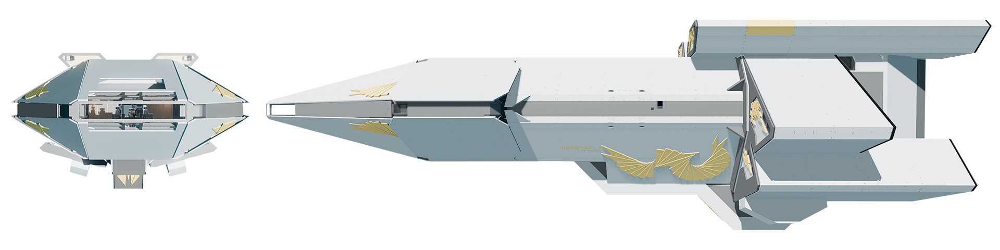
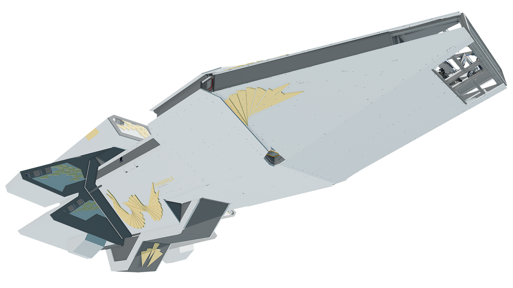
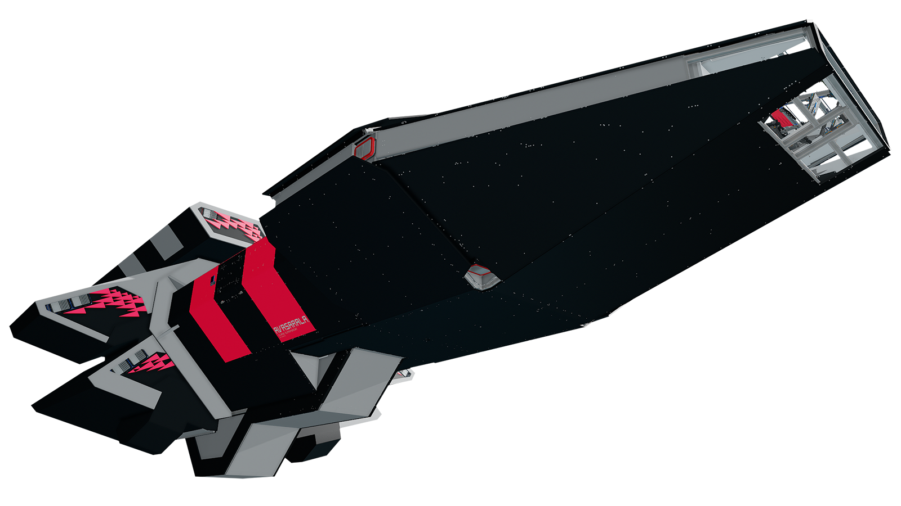

# Avasarala

## The Avasarala Class Super Yacht

[As seen at EosCon](https://coda.io/d/EosCon-July-2022-Flyer_dKX9qJsmRR1/Haywire-Dynamics_suyru#Haywire-Dynamics-Ships_tue2h/r44&view=modal)

The Avasarala is my attempt at making a very form-over-function ship with intricate platework.
I burnt out after working on it for months so its yolol systems could use more work, which means it could be a great foundation for a ship design of your own.

[The blueprint is free](#downloads). I greatly appreciate [in-game donations](#how-to-support--donate) as support if you like the ship. ❤️

It took months of work but I don't feel right forcing payments for it when Starbase needs as many players enjoying it as possible so I take optional donations. My rule of thumb: try the ship out for free and then make a donation if you like it!

## Downloads

[Download Blueprint](https://github.com/HaywireEndo/starbase-ships/raw/main/avasarala/blueprints/Avasarala-Mk1.fbe).

[Download Blueprint (Black and Red Version)](https://github.com/HaywireEndo/starbase-ships/raw/main/avasarala/blueprints/Avasarala-Razor-Mk1.fbe).

The blueprint files are also available in the 'blueprints' folder

## How to Support / Donate

- In Starbase, open your social tab ("O" by default)
- Go to Inbox -> Compose
- Put "Haywire" as the recipient, add a subject line of your choosing, add your monetary donation to the credits amount, and send.

Thank you for your support!!!

## Blueprint Importing Directions

- Navigate to C:\Users\ "Your Name" \AppData\Roaming\Starbase\ssc\autosave\ship_blueprints
- Delete all files in that folder (optional)
- Place the blueprint (.FBE) file in that folder
- Rename the file to ship_1 (or another number)
- In-game, go to the ship design workshop and open the designer
- Go to File -> Open or manage blueprints -> autosaves
- Open the blank file (The ship should appear now)
- Then go to Save As and save the ship as your own blueprint.

### Features
- Automatic Hover (for areas with gravity)
- Automatic Generator Management
- Transponder Readout (Safezone, Damage, etc)
- Fuel and Propellant Time Remaining Calculators
- 2 Sensitivity Modes
- Speedometer
- Decorative Rain Animations

### Notes:
- **More statistics will be added to this page soon**
- **Ship controls explanation will be added soon**
- Top speed is a bit slow (around 110), but can be easily increased by adding more plasma thruster rings within the fuselage.
- Named after [Chrisjen Avasarala](https://expanse.fandom.com/wiki/Chrisjen_Avasarala_(TV)), the head of state and government of Earth and Luna in the excellent series called 'The Expanse'

## Changelog

### Mark 1

- Initial release

## Known Issues

- The hover system is untested, use at your own risk
- The fuel and propellant remaining calculators only function under load
- Ship roll is slow

## Derivatives 

Can I create and share modified versions of this ship?
Yes, you can on three conditions:

- You must give it away for free (like this one is) (taking **optional** donations is fine)
- You must make some reference to this ship or me. For example: "Here is my ship, based on an Avasarala by Haywire"
- You must accept that those versions will be considered feedback and elements of them may be incorporated into future official releases without notification.

___