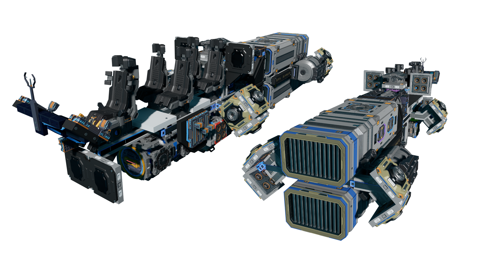
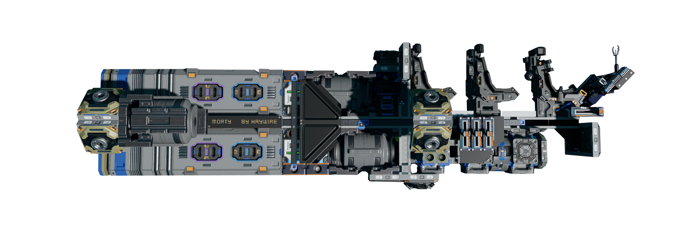
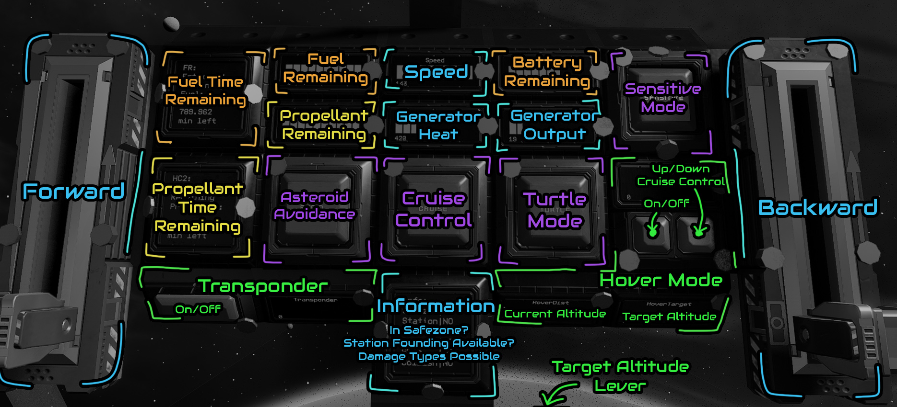

# Morty

Morty is an extremely simple and inexpensive long range scout ship/shuttle. Great for station hopping, long commutes, reconnaissance missions, or just sightseeing. [The blueprint is free](#download-blueprint). [All feedback is welcome](#providing-feedback). I don't have a lot of free time so support is limited.

[Starbase Ship Shop Page](https://sb-creators.org/makers/Haywire%20Dynamics/ship/%5BFREE%5D%20Morty)

## Downloads

[Download Blueprint](https://github.com/HaywireEndo/starbase-ships/raw/main/morty/blueprints/Morty-Mk3.fbe).

The blueprint file is also available in the 'blueprints' folder

## Stats

- Speed: 148m/s (passengers carrying loads bring the speed down)
- Range: 2700km (4500km if a spare fuel rod is brought)
- Seats: 5, bring your friends!

### Features

- Automatic Asteroid Avoidance
- Automatic Hover (for areas with gravity)
- Automatic Generator Management
- Transponder Readout (Safezone, Damage, etc)
- Fuel and Propellant Time Remaining Calculators
- 2 Sensitivity Modes
- Speedometer

## Build Cost

Designed to be as inexpensive as possible without sacrificing quality

| Ore | Stacks |
|---|---|
| Ajatite | 1.0 |
| Bastium | 2.8 |
| Charodium | 2.3 |
| Ice | 2.3 |
| Nhurgite | 1.2 |
| Vokarium | 3.8 |

## Details

| Attribute | Value |
|---|---|
| Assembly Cost | 12941 credits |
| Total Cost (no premade items) | ~31000 credits |
| Length | 11.0m |
| Beam (Width) | 3.8m |
| Height | 3.1m |
| Integrity | 17 |
| Mass | 139600kg |
| Speed | 148m/s |
| Range | 2700km (4500km with space rod) |
| Flight Time | 3.2h (8.4h with spare rod) |
| Max Battery | 30K |
| Max Power | 1K |
| Max Propellant | 4M |
| Resource Bridges | 1 |
| Primary Thrusters | 2 Box T1 |
| Maneuvering Thrusters | 10 T1 |

## Changelog

### Mark 3 - 7/19/2022

- Initial release

### Mark 2 and 1

- Before initial release, no information available

## Usage

| Interface | Function |
|---|---|
| FR | Fuel Time Remaining in Minutes (estimated by current drain rate) |
| Fuel | Fuel Remaining 0-300000 |
| Speed | Current speed of the ship from the speedometer device |
| Battery | Battery Remaining 0-10000 |
| Sensitive | Sensitive mode. Increases turning speed agility |
| Propellant | Propellant Remaining 0-4000000 |
| GenHeat | Generator Heat 0-1500 |
| GenOutput | Generator Output 0-100 |
| HC2 | Propellant Time Remaining in Minutes (estimated by current drain rate) |
| Avoid | Automatic Asteroid Avoidance |
| Cruise | Cruise control. Forward thrust won't decrease over time |
| Turtle | Turtle mode. Forward thrust and turning speed reduced by 85% |
| Hover | Hover Mode. Stays at specified altitude |
| HoverDist | Current altitude |
| HoverTarget | Target altitude |
| Transponder | Turns transponder on/off |
| Info | Shows data from the transponder. Transponder might need to be on. |

## Known Issues

- The hover system isn't amazing, use at your own risk
- The fuel and propellant remaining calculators only function under load

## Providing Feedback

My in-game name is Haywire, feel free to send me an in-game email!

I would love to hear any suggestions you may have! Keep in mind however, that I may choose to not implement them due to lack of time or personal discretion.

## Derivatives 

Can I create and share modified versions of this ship?
Yes, you can on three conditions:

- You must give it away for free (like this one is)
- You must make some reference to this ship or me. For example: "Here is my ship, based on a Morty by Haywire"
- You must accept that those versions will be considered feedback and elements of them may be incorporated into future official releases without notification.

___